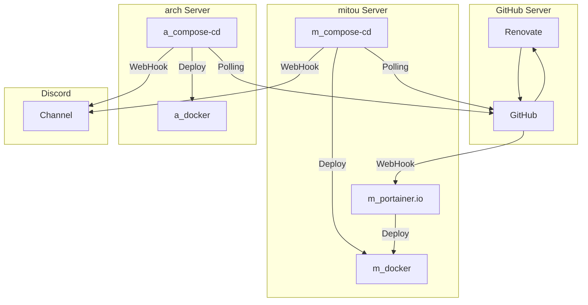

# yr32infra

```mermaid
graph TD;
    subgraph GitHub Server
    Renovate-->GitHub
    GitHub-->Renovate
    end
    
    subgraph mitou Server
    m_compose-cd--Polling-->GitHub
    GitHub--WebHook-->m_portainer.io
    m_compose-cd--Deploy-->m_docker
    m_portainer.io--Deploy-->m_docker
    end
      
    subgraph arch Server
    a_compose-cd--Polling-->GitHub
    a_compose-cd--Deploy-->a_docker
    end
    
    subgraph Discord
    a_compose-cd--WebHook-->Channel
    m_compose-cd--WebHook-->Channel
    end
```
