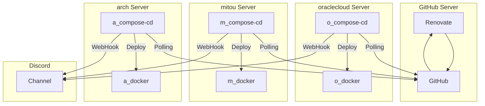

# yr32infra

[Kanban is here!](https://github.com/orgs/yr32infra/projects/1)

```mermaid
graph TD;
    subgraph GitHub Server
    Renovate-->GitHub
    GitHub-->Renovate
    end
    
    subgraph oraclecloud Server
    o_compose-cd--Polling-->GitHub
    o_compose-cd--Deploy-->o_docker
    end

    subgraph mitou Server
    m_compose-cd--Polling-->GitHub
    m_compose-cd--Deploy-->m_docker
    end
      
    subgraph arch Server
    a_compose-cd--Polling-->GitHub
    a_compose-cd--Deploy-->a_docker
    end
    
    subgraph Discord
    a_compose-cd--WebHook-->Channel
    m_compose-cd--WebHook-->Channel
    o_compose-cd--WebHook-->Channel
    end
```

